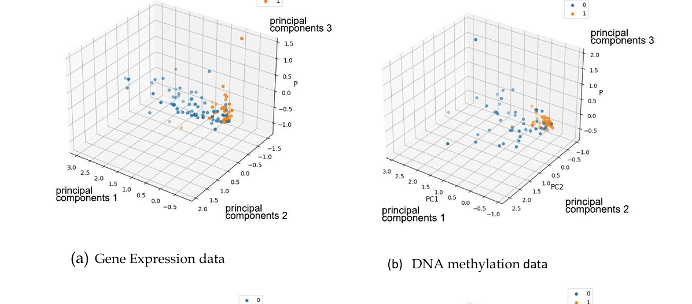
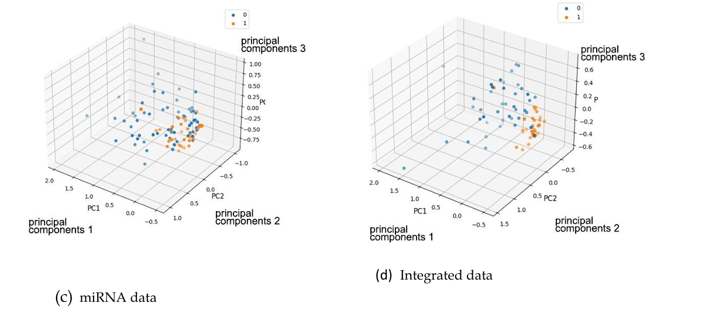
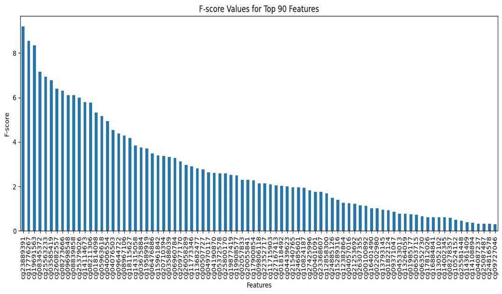
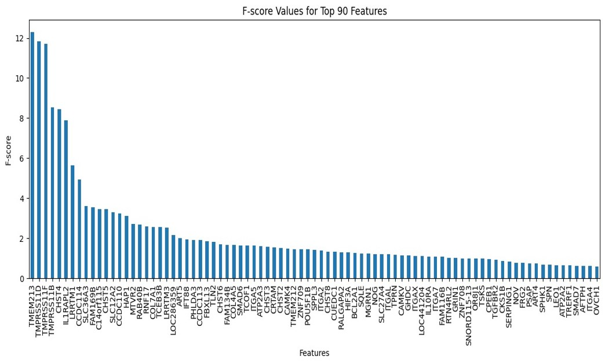
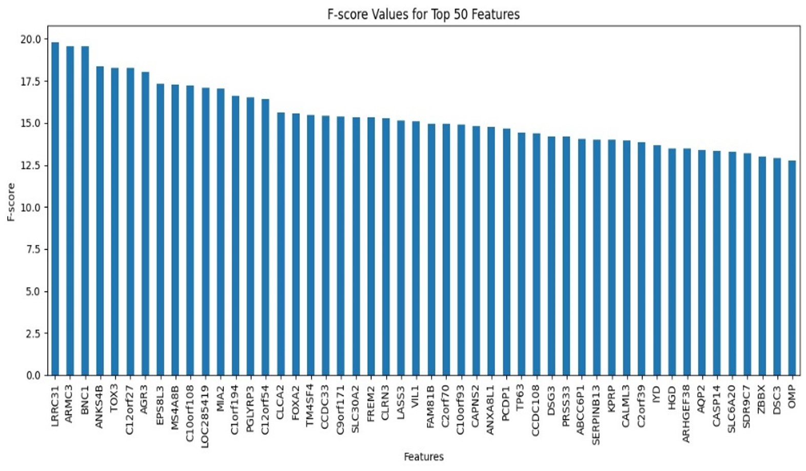
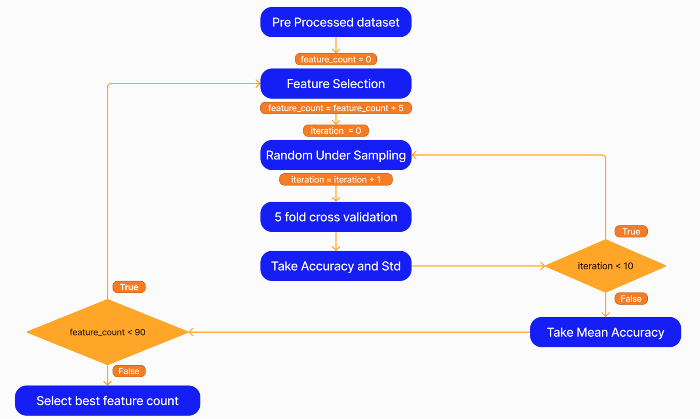
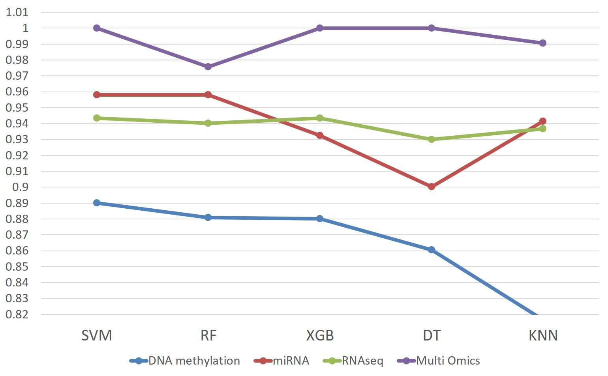

# Multi-Omic Data In The Cervical Cancer Study

This repository contains code and resources for the research project titled "Multi-omic Data in Cervical Cancer Studies using Machine Learning."

## Cervical Cancer Introduction

Cervical cancer is one of the most commonly diagnosed cancers affecting the cervix in women. The majority of cases are diagnosed between the ages of 20-29, peak between 55-64 years, and become rarer beyond the age of 65. The high mortality rate is often due to limited early detection techniques, especially in developing countries.

## Aim

- To identify cervical cancer subtypes using multi-omic data from patients.

## Scope

- Enhance machine learning models to identify cervical cancer subgroups more accurately.

## Dataset

### Data Integration

### Data preprocessing

We utilize the TCGA (The Cancer Genome Atlas) data for our research. The following omics are used:

| Omic             | Type               |
|------------------|--------------------|
| DNA Methylation  | Methylation450k     |
| Gene Expression  | Gene expression     |
| miRNA            | IlluminaHiseq       |

Please note that due to data privacy restrictions, the TCGA dataset cannot be included in this repository. 

## Cervical Cancer Subtypes

Based on the multi-omic data analysis, the cervical cancer cases can be classified into the following molecular subtypes in our dataset:

| Subtype                                      | Percentage | Number of Patients |
|----------------------------------------------|------------|--------------------|
| Adenosquamous                                | 2.244%     | 7                  |
| Cervical Squamous Cell Carcinoma             | 82.372%    | 257                |
| Endocervical Type of Adenocarcinoma          | 7.051%     | 22                 |
| Endocervical Adenocarcinoma of the Usual Type| 1.923%     | 6                  |
| Mucinous Adenocarcinoma of Endocervical Type | 5.449%     | 17                 |
| Endometrioid Adenocarcinoma of Endocervix    | 0.962%     | 3                  |

Cervical cancer can be categorized into the following main types based on the cells in which they originate:

### Adenocarcinoma

Adenocarcinoma starts in the glandular cells of the cervix, which are responsible for mucus production. It accounts for about **20% of cases**. The following subtypes are included under Adenocarcinoma:

- **Endocervical adenocarcinoma of the usual type**
- **Endocervical type of adenocarcinoma**
- **Endometrioid adenocarcinoma of endocervix**
- **Mucinous adenocarcinoma of endocervical type**  

### Squamous Cell Carcinoma

Squamous cell carcinoma is the **most common type** of cervical cancer, accounting for about **70% of cases**. It begins in the squamous cells, which are the flat cells lining the outer part of the cervix.

- **Cervical squamous cell carcinoma**

### Adenosquamous Carcinoma

Adenosquamous carcinoma is a rare type of cervical cancer, involving both squamous cells and glandular cells. These are also known as **mixed carcinomas**.

- **Adenosquamous carcinoma**

## Principal Component Analysis results (PCA)

Visualization of the Main Cancer Types. Using PCA, we observed a clear separation between the two main cervical cancer types:

- **Adenocarcinoma**: This type forms its own cluster, distinct from Squamous Cell Carcinoma.
- **Squamous Cell Carcinoma**: This type also forms a separate cluster, with minimal overlap between the two.

This visualization helps confirm that the multi-omic data (DNA methylation, gene expression, and miRNA profiles) contains significant patterns that allow machine learning models to effectively distinguish between these cancer subtypes.

## Chi-Square Test for Feature Selection

To assess the importance of individual features in each omic type (DNA methylation, gene expression, miRNA), we performed a **Chi-Square test**. This test helps identify the features that are most relevant for distinguishing between cervical cancer subtypes (Adenocarcinoma and Squamous Cell Carcinoma).

### Visualization of Chi-Square Feature Importance

We plotted the features along the **y-axis** and their corresponding **Chi-Square values** on the **x-axis**. Each omic type (DNA methylation, gene expression, miRNA) was represented separately in the graph. 

DNA Methylation - Chi Squared

Gene expression - Chi Squared

MicroRNA - Chi Squared

However, in the resulting plots, we observed that:

- There was **no distinct point** where the graph touched the x-axis for any of the omic types.
- This suggests that while some features were more important than others, **all features had some degree of contribution** based on their Chi-Square value, though their relevance may vary.

This visualization provides insights into the distribution of feature importance but highlights the continuous nature of the feature relevance without a clear cutoff point for feature elimination. In the Chi-Square plots, we observed that none of the features completely touched the x-axis, indicating that **all features contributed to some extent**. To determine the optimal number of features for our machine learning model, we implemented the following solution:

1. **Iterative Feature Selection**: We looped through the ranked features, incrementally increasing the number of selected features in each iteration.
   
2. **Model Accuracy Check**: For each subset of features, we trained a machine learning model and measured its accuracy. This allowed us to:
    - Identify how the model's performance changes as we include more features.
    - Find the point at which **adding more features no longer improves accuracy**.

3. **Best Feature Count**: Based on this approach, we determined the **optimal number of features** that yielded the highest accuracy while avoiding overfitting or performance degradation.

### Cross-Validation and Random Undersampling

To ensure robust model evaluation, we used **5-fold cross-validation** during the iterative feature selection process. This allowed us to:
- **Reduce the risk of overfitting** by training and testing the model on different subsets of the data.
- **Ensure a more generalizable model** by validating the model on multiple partitions of the dataset.

Since our dataset was imbalanced, we applied **random undersampling** to balance the classes, specifically iterating this process **10 times**. For each iteration:
1. A new undersampled dataset was created by randomly selecting an equal number of samples from each class (e.g., Adenocarcinoma and Squamous Cell Carcinoma).
2. The machine learning model was trained on this balanced dataset.
3. Accuracy was recorded for each iteration.

After running the **10 iterations**, we computed the **mean accuracy** across all the iterations. This ensured that the accuracy metric was **more reliable** and not dependent on any single random undersample, allowing for a more robust evaluation of the model’s performance.

## Algorithms

Five machine learning algorithms were employed to classify cervical cancer subtypes based on multi-omic data. Below is a brief description of each:

- **Random Forest (RF)**:
  - A powerful ensemble learning method that constructs multiple decision trees and merges them to get a more accurate and stable prediction.
  
- **Support Vector Machine (SVM)**:
  - A supervised learning model used for classification tasks by finding the hyperplane that best separates the data into different classes.
  
- **K-Nearest Neighbor (KNN)**:
  - A non-parametric method that classifies instances based on the majority vote of their nearest neighbors.
  
- **Decision Tree (DT)**:
  - A simple and interpretable model that splits the data into subsets based on the feature that provides the most information gain.
  
- **eXtreme Gradient Boosting (XGB)**:
  - An efficient and accurate ensemble method that builds additive models in a forward stage-wise manner, optimizing differentiable loss functions.

Each of these algorithms was tuned and evaluated using performance metrics such as accuracy, precision, recall, and F1-score to determine the best-performing model.

## Results Comparison: Single-Omic vs Multi-Omic Data

The following image visualizes a comparison between models trained on **single-omic** data versus **multi-omic** data. The multi-omic approach combines DNA methylation, gene expression, and miRNA data to provide a more comprehensive view of the biological processes involved in cervical cancer. As seen from the results, the multi-omic model significantly outperforms single-omic models, leading to improved accuracy in identifying cervical cancer subtypes.

## Repository Structure

The repository is organized as follows:

- `data_preparation/`: Code and instructions for accessing and preprocessing the TCGA data.
- `feature_selection/`: Code for feature selection and analysis.
- `model_training/`: Code for training machine learning models using multi-omic data.
- `evaluation/`: Code for evaluating the performance of the models.
- `results/`: Directory to store the results and outputs generated during the research.
- `references/`: Relevant papers and articles used for literature review.

## Requirements

To run the code in this repository, you will need the following dependencies:

- NumPy
- Pandas
- Scikit-learn
- Matplotlib
- Seaborn
- XGBoost

Please refer to the individual directories for specific requirements and installation instructions.

## References

- **The Cancer Genome Atlas**: [https://cancergenome.nih.gov](https://cancergenome.nih.gov)

## Contributors

- [Nadun Channa](https://github.com/nadunchanna98)
- [Ruvindya Sachinthani](https://github.com/Ruvindya)
